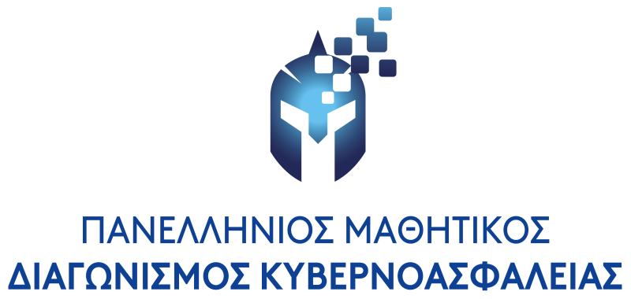

# Πανελλήνιος Μαθητικός Διαγωνισμός Κυβερνοασφάλειας (ΠΜΔΚ) 2025

O 3ος [Πανελλήνιος Μαθητικός Διαγωνισμός Κυβερνοασφάλειας](https://ecsc.gr/index.php/ethical-hacking-comp/) είναι η τρίτη έκδοση του πανελλαδικού διαδικτυακού Jeopardy-style Capture-The-Flag διαγωνισμού για μαθητές και μαθήτριες της Α΄, Β΄ και Γ΄ Λυκείου όλων των σχολείων της Ελλάδας. Ο διαγωνισμός διοργανώνεται από το [Τμήμα Ψηφιακών Συστημάτων του Πανεπιστημίου Πειραιώς](https://www.ds.unipi.gr) με την υποστήριξη των μελών της [Εθνικής Ομάδας Κυβερνοασφάλειας](https://ecsc.gr).

  
  
  

## Κύριες Δοκιμασίες

|   # | Κατηγορία                     | Δοκιμασία                                                                      | Δυσκολία | Λύσεις | Δημιουργός                                                      |
| --: | :---------------------------- | :----------------------------------------------------------------------------- | :------- | -----: | :-------------------------------------------------------------- |
|   1 | Κρυπτογραφία                  | [Discreet Psychologist](challenge-01-discreet-psychologist/writeup/)           | Μέτρια   |     20 | [eid3t1c](https://github.com/eid3t1c) |
|   2 | Κρυπτογραφία                  | [My Rainbow Sorcerer](challenge-02-my-rainbow-sorcerer/writeup/)               | Εύκολη   |     13 | [eid3t1c](https://github.com/eid3t1c) |
|   3 | Παγκόσμιος Ιστός              | [Chocolate Injection](challenge-03-chocolate-injection/writeup/)               | Μέτρια   |     21 | [GramThanos](https://github.com/GramThanos) |
|   4 | Ψηφιακή Εγκληματολογία        | [There was an incident!](challenge-04-there-was-an-incident/writeup/)          | Εύκολη   |     32 | [GramThanos](https://github.com/GramThanos) |
|   5 | Διάφορα                       | [Luck out loud](challenge-05-luck-out-loud/writeup/)                           | Εύκολη   |     19 | [Mike Takaronis](https://x.com/miketakaronis) |
|   6 | Εκμετάλλευση Δυαδικών Αρχείων | [Ping me](challenge-06-ping-me/writeup/)                                       | Εύκολη   |     33 | [Mike Takaronis](https://x.com/miketakaronis) |
|   7 | Διάφορα                       | [Beep Beeeeeeeep](challenge-07-beep-beeeeeeeep/writeup/)                       | Μέτρια   |     30 | [GramThanos](https://github.com/GramThanos) |
|   8 | Παγκόσμιος Ιστός              | [Minesweeper](challenge-08-minesweeper/writeup/)                               | Μέτρια   |     15 | [GramThanos](https://github.com/GramThanos) |
|   9 | Παγκόσμιος Ιστός              | [Defaced](challenge-09-defaced/writeup/)                                       | Εύκολη   |     49 | [GramThanos](https://github.com/GramThanos) |
|  10 | Παγκόσμιος Ιστός              | [Satellite Hijack v1](challenge-10-satellite-hijack-v1/writeup/)               | Εύκολη   |     15 | [Doth-J](https://github.com/Doth-J) |
|  11 | Παγκόσμιος Ιστός              | [Satellite Hijack v2](challenge-11-satellite-hijack-v2/writeup/)               | Μέτρια   |      4 | [Doth-J](https://github.com/Doth-J) & [GramThanos](https://github.com/GramThanos) |
|  12 | -                             | Η δοκιμασία αφαιρέθηκε για τεχνικούς λόγους                                    | -        |      - | - |
|  13 | Εκμετάλλευση Δυαδικών Αρχείων | [Rope Chain](challenge-13-rope-chain/writeup)                                  | Δύσκολη  |      3 | [Mike Takaronis](https://x.com/miketakaronis) |
|  14 | Κρυπτογραφία                  | [Best Wishes](challenge-14-best-wishes/writeup/)                               | Εύκολη   |      9 | [r4sti](https://www.youtube.com/@pliromatics2692) |
|  15 | Κρυπτογραφία                  | [Hastalavista](challenge-15-hastalavista/writeup/)                             | Μέτρια   |     15 | [r4sti](https://www.youtube.com/@pliromatics2692) |
|  16 | Αντίστροφη Mηχανική           | [It is all about da strings](challenge-16-it-is-all-about-da-strings/writeup/) | Εύκολη   |     39 | [GramThanos](https://github.com/GramThanos) |
|  17 | Αντίστροφη Mηχανική           | [To nim or not to nim](challenge-17-to-nim-or-not-to-nim/writeup/)             | Δύσκολη  |      3 | [r4sti](https://www.youtube.com/@pliromatics2692) |
|  18 | Αντίστροφη Mηχανική           | [Emojious](challenge-18-emojious/writeup/)                                     | Εύκολη   |     33 | [Mike Takaronis](https://x.com/miketakaronis) |
|  19 | Ψηφιακή Εγκληματολογία        | [Quarantine](challenge-19-quarantine/writeup/)                                 | Mέτρια   |      9 | [vipolus](https://github.com/vipolus) |
|  20 | Ψηφιακή Εγκληματολογία        | [Null Traffic](challenge-20-null-traffic/writeup/)                             | Εύκολη   |     22 | [Σολωμός Άγγελος @scholar of Latsis Foundation, @scholar of HelleniQ Energy](https://github.com/connar) |
|  21 | Ψηφιακή Εγκληματολογία        | [Retro Calculator](challenge-21-retro-calculator/writeup/)                     | Δύσκολη  |     17 | [Σολωμός Άγγελος @scholar of Latsis Foundation, @scholar of HelleniQ Energy](https://github.com/connar) |
|  22 | Αντίστροφη Mηχανική           | [nwbin](challenge-22-nwbin/writeup/)                                           | Mέτρια   |     11 | [GramThanos](https://github.com/GramThanos) |
|  23 | Διάφορα                       | [Time for Darts](challenge-23-time-for-darts/writeup/)                         | Mέτρια   |     14 | Olga S |
|  24 | Αντίστροφη Mηχανική           | [Ascent Main](challenge-24-ascent-main/writeup/)                               | Mέτρια   |      9 | [Filippos Floros](https://github.com/YoungFlexerGR) |
|  25 | Διάφορα                       | [2 Gold Doubloons](challenge-25-2-gold-doubloons/writeup/)                     | Μέτρια   |     14 | [eid3t1c](https://github.com/eid3t1c) |

## Τελικός πίνακας βαθμολογίας

| Θέση | Ομάδα | Λύσεις | Πόντοι |
| ---: | :---- | -----: | -----: |
| 1 | Λύκειο Κολλεγίου Ψυχικού | 24 | 7501 |
| 2 | 2ο ΕΠΑ.Λ. Σιβιτανιδείου Σχολής | 24 | 7501 |
| 3 | Πρότυπο ΓΕΛ Αναβρύτων | 22 | 6317 |
| 4 | 1ο ΕΠΑΛ Θεσσαλονίκης | 22 | 6317 |
| 5 | Εκπαιδευτήρια Ε. Μαντουλίδη | 22 | 6311 |
| 6 | Εκπαιδευτήρια Δούκα | 22 | 6261 |
| 7 | 2ο ΓΕΛ Εχεδώρου | 17 | 3687 |
| 8 | Πρότυπο ΓΕΛ Αγ. Αναργύρων | 20 | 3554 |
| 9 | Μουσικό Γυμνάσιο Αγρινίου - Λ.Τ. | 15 | 3063 |
| 10 | 1ο Γενικό Λύκειο Ηλιούπολης | 13 | 3039 |
| 11 | 4ο Πειραματικό ΓΕΛ Τρικάλων "Αλέξανδρος Παπαδιαμάντης" | 21 | 2861 |
| 12 | Εκπαιδευτήρια Δούκα | 18 | 2201 |
| 13 | Γυμνάσιο Μύρινας | 12 | 1939 |
| 14 | Πρότυπο ΓΕΛ Αγ. Αναργύρων | 11 | 1232 |
| 15 | Anatolia College | 13 | 1084 |
| 16 | 2ο ΕΠΑΛ Κομοτηνής | 9 | 1080 |
| 17 | Α΄ Αρσάκειο Τοσίτσειο ΓΕΛ Εκάλης | 10 | 919 |
| 18 | 2ο Πρότυπο ΓΕΛ Θεσσαλονίκης - "Λευκός Πύργος" | 10 | 907 |
| 19 | Πρότυπο ΓΕΛ Αγ. Αναργύρων | 7 | 797 |
| 20 | 1ο Πρότυπο ΓΕΛ Χαλκίδας | 10 | 790 |
| 21 | Anatolia College | 11 | 767 |
| 22 | ΕΚ Νεάπολης | 9 | 660 |
| 23 | ΕΚ Ευόσμου | 9 | 642 |
| 24 | 1ο Εργαστηριακό Κέντρο (Ε.Κ.) Λαμίας | 9 | 602 |
| 25 | Γενικό Λύκειο Χιλιομοδίου | 5 | 595 |
| 26 | Anatolia College | 5 | 438 |
| 27 | 1ο Πειραματικό Γενικό Λύκειο Λάρισας | 7 | 375 |
| 28 | Λεόντειος Σχολή Αθηνών | 7 | 350 |
| 29 | Μουσικό Σχολείο Χίου | 6 | 300 |
| 30 | Μουσικό Σχολείο Χίου | 6 | 300 |
| 31 | 3ο ΓΕΛ Καλαμαριάς | 6 | 300 |
| 32 | 2ο ΓΕΛ Εχεδώρου | 3 | 278 |
| 33 | 2ο ΕΠΑ.Λ. Σιβιτανιδείου Σχολής | 5 | 250 |
| 34 | Πρότυπο ΓΕΛ Αγ. Αναργύρων | 4 | 200 |
| 35 | 2ο ΕΠΑΛ Κομοτηνής | 4 | 200 |
| 36 | ΕΚ Ευόσμου | 4 | 200 |
| 37 | Μουσικό Σχολείο Χανίων | 2 | 200 |
| 38 | Μουσικό Σχολείο Βέροιας | 3 | 150 |
| 39 | 2ο ΓΕΛ Πυλαίας | 3 | 150 |
| 40 | 2ο ΕΠΑ.Λ. Σιβιτανιδείου Σχολής | 3 | 150 |
| 41 | Γενικό Λύκειο Αγιάς | 3 | 150 |
| 42 | 1ο ΓΕΛ Αιγάλεω | 2 | 100 |
| 43 | 1ο ΕΠΑ.Λ Δάφνης | 2 | 100 |
| 44 | 1ο ΕΠΑΛ Συκεών | 2 | 100 |
| 45 | 2ο ΕΠΑ.Λ. Σιβιτανιδείου Σχολής | 1 | 50 |
| 46 | Α΄ Αρσάκειο Τοσίτσειο ΓΕΛ Εκάλης | 1 | 50 |
| 47 | ΕΚ Ευόσμου | 1 | 50 |
| 48 | 2ο ΓΕΛ Εχεδώρου | 1 | 50 |
| 49 | 2ο ΓΕΛ Εχεδώρου | 1 | 50 |
| 50 | 2ο ΓΕΛ Εχεδώρου | 1 | 50 |
| 51 | 1ο ΕΠΑΛ Συκεών | 1 | 50 |
