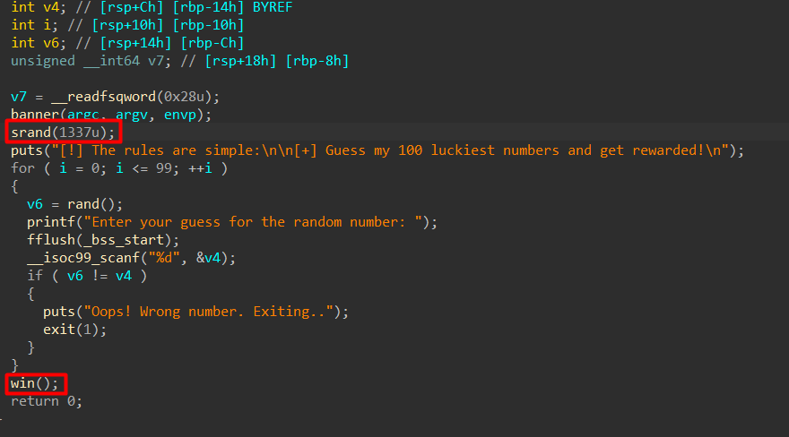
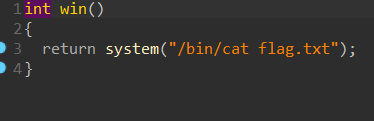

# Luck out loud Write-Up

| Δοκιμασία | Luck out loud      |
| :-------- | :----------------- |
| Δυσκολία  | Εύκολη             |
| Κατηγορία | Διάφορα (Miscellaneous) |
| Λύσεις    | 19                 |
| Πόντοι    | 195                |

## Περιγραφή Δοκιμασίας

I wanna play a game of luck..


## Ανάλυση Δοκιμασίας

Στη δοκιμασία αυτή μας δίνεται ένα δυαδικό αρχείο (luck-out-loud), το οποίο ζητά από τον παίκτη να μαντέψει μια σειρά από τυχαίους αριθμούς. Για να ολοκληρώσουμε την πρόκληση, πρέπει να δώσουμε 100 σωστούς αριθμούς στη σειρά.

Η πιο πιθανή προσέγγιση για να το πετύχουμε αυτό είναι να κατανοήσουμε πώς δημιουργούνται αυτοί οι "τυχαίοι" αριθμοί. Αναλύοντας το δυαδικό, διαπιστώνουμε ότι χρησιμοποιεί μια σταθερή seed τιμή για τη γεννήτρια ψευδοτυχαίων αριθμών (srand). Αυτό σημαίνει ότι η έξοδος της rand() είναι προβλέψιμη αν γνωρίζουμε την seed τιμή.


## Επίλυση


### Ανάλυση και Εύρεση του seed

Αναλύοντας το αρχείο σε ένα decomplier μπορούμε να δούμε τη main του συστήματος.



Βλέπουμε ότι η συνάρτηση srand αρχικοποιείται με σταθερό seed:

```c
srand(1337);
```

Αυτό σημαίνει ότι η ακολουθία των αριθμών που παράγει η rand() είναι πάντα η ίδια.

Επίσης βλέπουμε ότι αν πετύχουμε αυτό το αποτέλεσμα καλείται η win η οποία μας εκτυπώνει το flag



Χρησιμοποιούμε την libc για να αναπαράγουμε αυτούς τους αριθμούς:

```python
from ctypes import CDLL

def get_rand(seed, count):
    clibc = CDLL("libc.so.6")
    clibc.srand(seed)
    
    rand_values = [clibc.rand() for _ in range(count)]
    return rand_values

# Παράγουμε τους 100 αριθμούς
numbers = get_rand(1337, 100)
print(numbers)
```

Αυτό μας δίνει τη σωστή σειρά αριθμών που πρέπει να εισάγουμε στο πρόγραμμα για να κερδίσουμε.

### Αυτοματοποίηση της διαδικασίας με Exploit

Αντί να εισάγουμε τους αριθμούς χειροκίνητα, δημιουργούμε ένα script με το pwntools, το οποίο αυτοματοποιεί την επίλυση της πρόκλησης.

```python
#!/usr/bin/python3
from pwn import *
from ctypes import CDLL

elf = context.binary = ELF("./luck-out-loud", checksec=False)

IP = "localhost"
PORT = 4242     

def start():
    return remote(IP, PORT) if args.REMOTE else process(elf.path)

def get_rand(seed, count):
    clibc = CDLL("libc.so.6")
    clibc.srand(seed)
    
    return [clibc.rand() for _ in range(count)]

def pwn():
    io = start()
    random_numbers = get_rand(1337, 100)

    for number in random_numbers:
        io.sendlineafter(b"Enter your guess for the random number: ", str(number).encode())

    io.interactive()

if __name__ == "__main__":
    pwn()
```

Αυτό το script συνδέεται στο πρόγραμμα, παράγει τους 100 σωστούς αριθμούς και τους στέλνει αυτόματα.

## Ανάκτηση σημαίας

Αφού τρέξουμε το script στον server, το πρόγραμμα αναγνωρίζει όλες τις σωστές απαντήσεις και εμφανίζει τη σημαία


## Σημαία

```
FLAG{St4t1c_s33ds_4r3_l1k3_pr3d1ct4bl3_f0rtun3_c00k13s}
```
