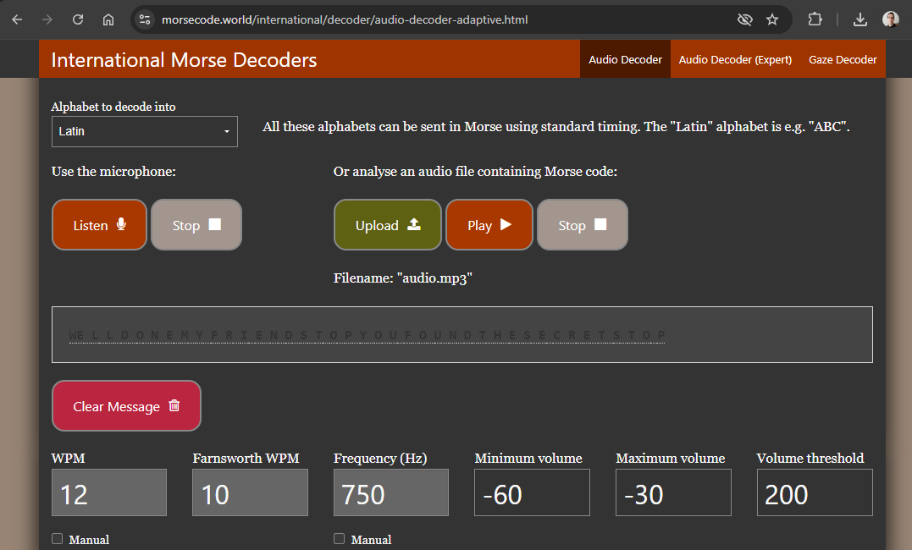

# Beep Beeeeeeeep Write-Up

| Δοκιμασία | Beep Beeeeeeeep |
| :------- | :----- |
| Δυσκολία | Μέτρια |
| Κατηγορία | Διάφορα (Miscellaneous) |
| Λύσεις | 30 |
| Πόντοι | 100 |

## Περιγραφή δοκιμασίας
Τι είναι αυτό που φαίνεται στο παρασκήνιο της φωτογραφίας που αναρτήθηκε στα social για τον ΠΜΔΚ 2025; Μοιάζει σαν... όχι δεν δουλεύει...

## Επίλυση

### QR Code
Το παρασκήνιο της φωτογραφίας που αναρτήθηκε στα social για τον ΠΜΔΚ 2025 αχνο-φαίνεται ένα QR code, το οποίο όμως είναι πολύ αχνό για να το σαρώσουμε. ας προσπαθήσουμε να επεξεργαστούμε την φωτογραφία για να μπορέσουμε να το καθαρίσουμε. Για την επεξεργασία της εικόνας μπορεί να γίνει χρήση του δωρεάν λογισμικού ανοιχτού κώδικα [GIMP](https://www.gimp.org/).

Αρχικά κόβουμε την φωτογραφία και επικεντρωνόμαστε στην περιοχή που έχει το QR code:


Στην συνέχεια με σβήνουμε ένα-ένα τα γράμματα καθώς και το λογότυπο τα οποία έχουν πανω-γράψει το QR code:


Για να τονίσουμε το QR code καλύτερα, κάνουμε χρήση του εργαλείου threshold, θέτοντας την επιλογή του threshold χαμηλά (λίγο κάτω από το επίπεδο του αχνού γκρι με το οποίο είναι βαμμένο το QR code) το οποίο θα μετατρέψει την εικόνα μας σε ασπρόμαυρη:


Έπειτα, με το μαύρο πινέλο, γεμίζουμε τα κομμάτια του QR code τα οποία έχουν καταστρέψει τα γράμματα και το λογότυπο που αφαιρέσαμε:


Για να καθαρίσουμε το QR code, το κάνουμε scale σε 15x15 pixel, ένα pixel δηλαδή για κάθε κουτάκι του QR code:


Σαρώνοντας το QR code, βλέπουμε πως λειτουργεί και παίρνουμε το λινκ:
```
https://youtu.be/YliF8ZvJ9zQ
```

### Youtube Video

Το link μας στέλνει σε ένα video στο οποίο ακούγονται ήχοι. Από τον τίτλο `M3SS4G3_M0RS3.MP4` υποπτευόμαστε πως είναι κώδικας MORSE.

Αρχικά κατεβάζουμε το video για να το επεξεργαστούμε πιο εύκολα (για να κατεβάζουμε Youtube videos μπορούμε να κάνουμε χρήση κάποιου online εργαλείου αλλά χρειάζεται προσοχή για να μην κατεβάσουμε κάποιο κακόβουλο λογισμικό).


Για απομονώσουμε μόνο τον ήχο από το video μπορούμε να χρησιμοποιήσουμε το δωρεάν λογισμικό ανοιχτού κώδικα [ffmpeg](https://www.ffmpeg.org/). Η μετατροπή μπορεί να γίνει με την εντολή:
```
ffmpeg -i video.mp4 audio.mp3
```

Στην συνέχεια μπορούμε να ανοίξουμε τον ήχο με κάποιο πρόγραμμα επεξεργασίας ήχου όπως το δωρεάν λογισμικό ανοιχτού κώδικα [Audacity](https://www.audacityteam.org/) (σαν διαφήμιση για λογισμικό ανοιχτού κώδικα έγινε αυτή η δοκιμασία...) και να αποκωδι8κοποιήσουμε τις παύλες και τις τελείες για να τις μετατρέψουμε σε γράμματα βάση του [κώδικα morse](https://el.wikipedia.org/wiki/%CE%9A%CF%8E%CE%B4%CE%B9%CE%BA%CE%B1%CF%82_%CE%9C%CE%BF%CF%81%CF%82).


Διαφορετικά μπορούμε να χρησιμοποιήσουμε και κάποιο αυτοματοποιημένο εργαλείο για να μας κάνει την αποκωδικοποίηση, όπως το [Morse Code Adaptive Audio Decoder](https://morsecode.world/international/decoder/audio-decoder-adaptive.html):


Και βρίσκουμε το μήνυμα:
```
WELLDONEMYFRIENDSTOPYOUFOUNDTHESECRETSTOP
```
