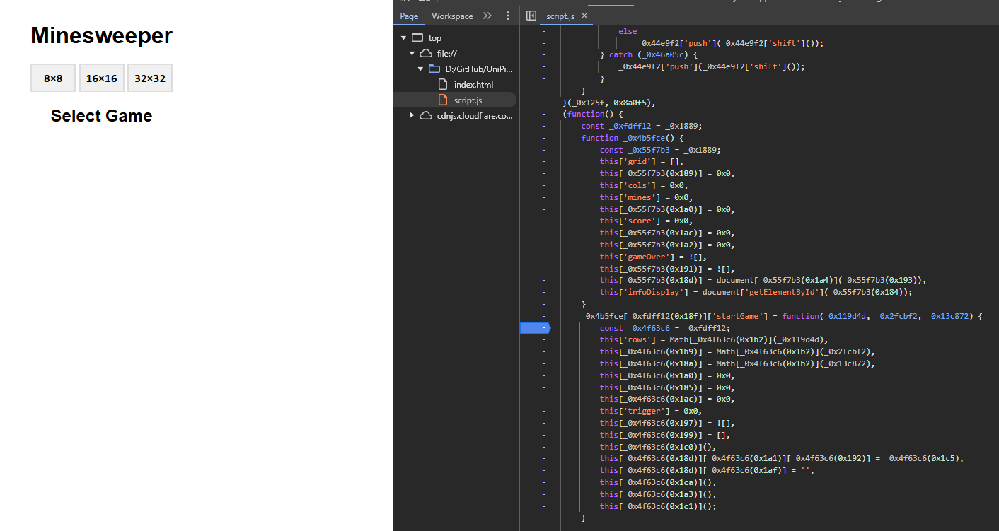
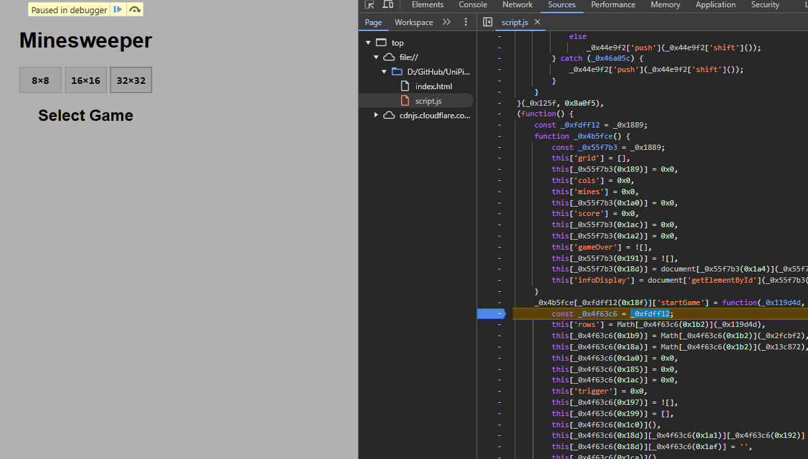
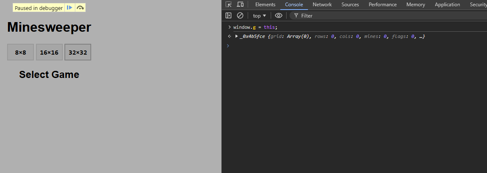
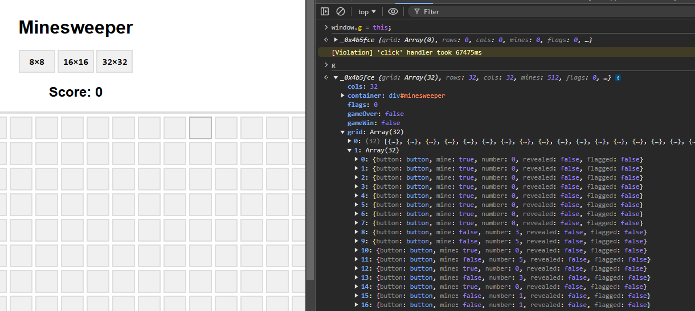

# Minesweeper Write-Up

| Δοκιμασία | Minesweeper |
| :------- | :----- |
| Δυσκολία | Μέτρια |
| Κατηγορία | Παγκόσμιος Ιστός (Web Exploitation) |
| Λύσεις | 15 |
| Πόντοι | 355 |


## Περιγραφή Δοκιμασίας

``` 
Το 8×8 είναι υπερβολικά εύκολο... μπορείς να λύσεις το 32×32;
```


## Επίλυση
### Με μια πρώτη ματιά

Από την περιγραφή καταλαβαίνουμε πως μάλλον πρέπει να λύσουμε το 32×32 για να πάρουμε την σημαία.

### Ανάλυση - Εύρεση ευπάθειας - Exploitation

Αρχικά ψάχνοντας τον κώδικα της εφαρμογής, βλέπουμε πως είναι obfuscated αλλά μπορούμε υπάρχουν κάποια ονόματα συναρτήσεων από τα οποία μπορούμε να πάρουμε μερικές πληροφορίες (πχ. την συνάρτηση `startGame`).



Βάζουμε λοιπόν ένα break point στην συνάρτηση `startGame` με σκοπό να σταματήσουμε τον κώδικα εκεί και να δούμε τι μεταβλητές υπάρχουν εσωτερικά τους.



Με το που ξεκινήσουμε ένα παιχνίδι, το break point σταματάει την εκτέλεση, και μέσο της κονσόλας, μπορούμε να συνδέσουμε το εσωτερικό scope της συνάρτησης `startGame` σε μια μεταβλητή το παράθυρο, με την χρήση του `this`.



Τώρα μπορούμε να συνεχίσουμε την εκτέλεση του κώδικα, και έχουμε πρόσβαση και στις μεταβλητές του παιχνιδιού από την μεταβλητή που βάλαμε στο παράθυρο.



Αναλύοντας τις πληροφορίες μέσα στην μεταβλητή του παιχνιδιού, βλέπουμε πως έχουμε πρόσβαση στα κελιά του πίνακα μέσα στα οποία περιέχεται και η πληροφορία για το περιεχόμενό τους. Έτσι, μπορούμε να εκτελέσουμε ένα κώδικα που θα φιλτράρει όλα τα κελιά βάση του αν έχουν μέσα νάρκη ή όχι, και στην συνέχεια θα κάνει click όλα τα κελιά τα οποία δεν έχουν νάρκη:

```javascript
g.grid.forEach(row => row.filter((c) => !c.mine).forEach((c) => {c.button.click();}));
```

Με αυτόν τον τρόπο θα νικήσουμε το παιχνίδι και θα ανοίξει ένα παράθυρο με την σημαία.

## Σημαία

```
FLAG{1_tH1nK_i_g0t_eN0ugh_G4me_H4ck1nG_FuN_4_tOdAY!}
```
