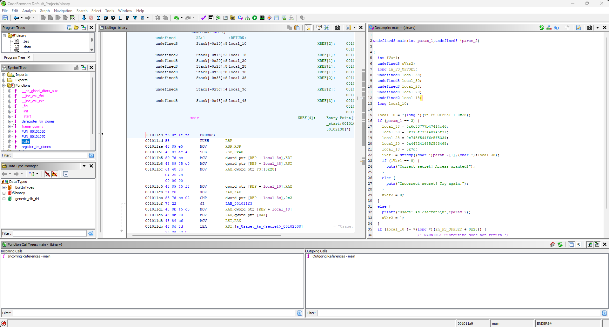

# It is all about da strings Write-Up

| Δοκιμασία | It is all about da strings |
| :------- | :----- |
| Δυσκολία | Εύκολη |
| Κατηγορία | Αντίστροφη Mηχανική (Reverse Engineering) |
| Λύσεις | 39 |
| Πόντοι | 100 |

## Περιγραφή Δοκιμασίας

Η δοκιμασία μας δίνει ένα εκτελέσιμο αρχείο.

### Επίλυση (Τρόπος Α)

Από το όνομά της υποπτευόμαστε πως ίσως έχει να κάνει με την εντολή `strings`, οπότε μπορούμε να την εκτελέσουμε δίνοντας το εκτελέσιμο αρχείο για να δούμε αν θα βγάλει κάτι:
```
user@potato:~/challenge$ strings ./binary
/lib64/ld-linux-x86-64.so.2
libc.so.6
puts
__stack_chk_fail
printf
__cxa_finalize
strcmp
__libc_start_main
GLIBC_2.4
GLIBC_2.2.5
_ITM_deregisterTMCloneTable
__gmon_start__
_ITM_registerTMCloneTable
u+UH
FLAG{w3lH
1_tH1s_wH
4S_nOT_tH
h4T_hArDH
[]A\A]A^A_
Usage: %s <secret>
Correct secret! Access granted!
Incorrect secret! Try again.
...
```

Παρατηρούμε πως μια σειρά από κείμενα μοιάζουν με το flag:

```
FLAG{w3lH
1_tH1s_wH
4S_nOT_tH
h4T_hArDH
```

Αν τα βάλουμε την σειρά, έχουμε:
```
FLAG{w3lH1_tH1s_wH4S_nOT_tHh4T_hArDH
```

Χμμ... κάτι δεν πάει καλά... μάλλον πρέπει να αφαιρέσουμε τα `Η` από το τέλος κάθε γραμμής και να προσθέσουμε ένα `}` στο τέλος:
```
FLAG{w3l1_tH1s_w4S_nOT_th4T_hArD}
```

### Επίλυση (Τρόπος Β)

Ανοίγουμε το εκτελέσιμο αρχείο με την χρήση του Ghidra για να ανακτήσουμε τον πηγαίο κώδικά του.


Από τον κώδικα που μας έδωσε το Ghidra έχουμε το αλφαριθμητικό ως HEX:
```
local_38 = 0x6c33777b47414c46;
local_30 = 0x775f733148745f31;
local_28 = 0x745f544f6e5f5334;
local_20 = 0x447241685f543468;
local_18 = 0x7d;
```

Αρχικά πρέπει να αναποδογυρίσουμε τα bytes, αρχικά έχουμε:
```
6c 33 77 7b 47 41 4c 46
77 5f 73 31 48 74 5f 31
74 5f 54 4f 6e 5f 53 34
44 72 41 68 5f 54 34 68
7d
```

Και τα μετατρέπουμε σε:
```
46 4c 41 47 7b 77 33 6c
31 5f 74 48 31 73 5f 77
34 53 5f 6e 4f 54 5f 74
68 34 54 5f 68 41 72 44
7d
```

Αν μετατρέψουμε τα bytes σε ascii παίρνουμε την σημαία:
```
FLAG{w3l1_tH1s_w4S_nOT_th4T_hArD}
```
