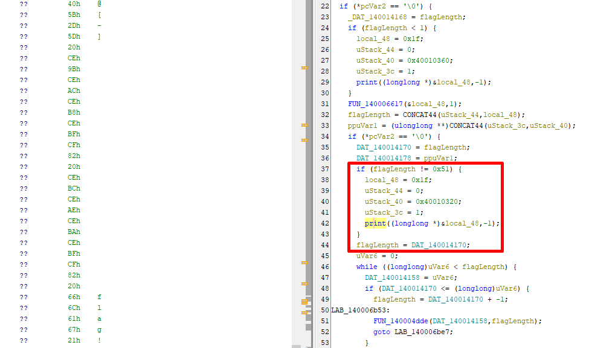

# **To Nim or Not to Nim** Write-Up

| Δοκιμασία | To nim or not to nim |
| :------- | :----- |
| Δυσκολία | Δύσκολη |
| Κατηγορία | Αντίστροφη Mηχανική (Reverse Engineering) |
| Λύσεις | 3 |
| Πόντοι | 595 |

## Περιγραφή Δοκιμασίας

```
Ιδού η απορία ...
```

## Επίλυση

Σε αυτό το challenge, μας δίνεται μόνο το εκτελέσιμο αρχείο `main.exe` και όπως σε όλα, ο σκοπός είναι να βρούμε το flag. Εφόσον δεν είναι κακόβουλο, ας δοκιμάσουμε να το εκτελέσουμε.


Βλέπουμε οτι το πρόγραμμα περιμένει ως παράμετρο, το flag του challenge. Αν δώσουμε ένα flag με λάθος μήκος, παίρνουμε το παρακάτω μήνυμα:


Από που προέρχονται όμως αυτά τα μηνύματα και που ελέγχεται η ορθότητα του κλειδιού στο πρόγραμμα; Πάμε να το ανακαλύψουμε χρησιμοποιώντας τον disassembler της αρεσκείας μας. Σε αυτό το writeup, θα προτιμήσουμε το ghidra καθώς είναι open source και μπορεί να το κατεβάσει ο οποιοσδήποτε, δωρεάν!

Πριν από αυτό όμως, πάμε να δούμε τα strings του προγράμματος χρησιμοποιώντας το εργαλείο `strings` του linux λειτουργικού. Γρήγορα θα παρατηρήσουμε ότι πρόκειται για ένα πρόγραμμα που είναι γραμμένο στην γλώσσα Nim. Πρόκειται για μια γλώσσα της οποίας το συντακτικό μοιάζει πολύ με της Python, χρησιμοποιείται κατά κόρον στα malware και έχει την δυνατότητα cross-compilation, δηλαδή να γίνει compile και για άλλες πλατφόρμες και CPU αρχιτεκτονικές εκτός από την τρέχουσα στην οποία γίνεται το compilation. Κάποιες από αυτές τις πλατφόρμες είναι: Windows, Linux, iOS, Android, Nintendo Switch και κάποιες από τις αρχιτεκτονικές είναι, i386, x86-64 και ARM.


Για αυτό το output, τρέξαμε την εντολή: `strings main.exe | less`.

Ας φορτώσουμε τώρα το εκτελέσιμο στο Ghidra.

Γρήγορα καταλαβαίνουμε ότι κατά το compilation, έγιναν strip τα symbols του προγράμματος. Με άλλα λόγια, δεν έχουμε τα ονόματα των συναρτήσεων κάτι που κάνει την δουλειά μας ως αναλυτές, αισθητά δυσκολότερη. Ωστόσο, υπάρχουν κάποιες τεχνικές που μπορούμε να ακολουθήσουμε για να εντοπίσουμε την main συνάρτηση. Σε αυτό το challenge, μπορεί να εφαρμοσθεί η εξής τεχνική: Γνωρίζουμε ότι αν τρέξουμε το πρόγραμμα και δεν δώσουμε παράμετρο, θα δούμε το string `[-] Χρήση: main.exe <flag>`. Πιθανότατα, η εμφάνιση αυτού του string, θα είναι στην ίδια συνάρτηση, ή έστω θα σχετίζεται, με την συνάρτηση η οποία ελέγχει την ορθότητα του κλειδιού.

Επιλέγουμε λοιπόν το tab `Window > Defined Strings` και βρίσκουμε το `main.exe <flag>` που είδαμε όταν τρέξαμε το πρόγραμμα. Αυτό θα μας οδηγήσει στην συνάρτηση που το εμφανίζει.


Βλέπουμε το string παρακάτω. Δεδομένου ότι το ελληνικό αλφάβητο δεν ανήκει στο standard ASCII πίνακα, δεν θεωρείται printable χαρακτήρας, άρα δεν μπορούμε να δούμε την λέξη `Χρήση`.


Πατάμε δεξί κλικ στο `DAT_140010350` και βρίσκουμε την συνάρτηση που χρησιμοποιεί αυτό το string.


Στην συνάρτηση που μας πηγαίνει, βλέπουμε ότι στο σημείο που φορτώνεται το string, καλείται κοντά η συνάρτηση `0x140005722`:


Ανοίγοντας την μέσα, θα δούμε ότι καλεί την `0x1400024b2` η οποία καλεί με την σειρά της την `fwrite`. Επομένως, καταλαβαίνουμε ότι η `0x140005722` είναι μια wrapper συνάρτηση για την print. Ας της δώσουμε λοιπόν ένα καλύτερο όνομα και ας συνεχίσουμε την ανάλυση μας.

Λίγο παρακάτω, βλέπουμε μια δεύτερη κλήση της print:



Έχοντας τρέξει ήδη μια φορά το πρόγραμμα, αντιλαμβανόμαστε ότι αυτός ο έλεγχος αφορά το μήκος του flag καθώς το μήκος του μηνύματος λάθους που φαίνεται στην ghidra ταιριάζει με το μήκος του `[-] Λάθος μήκος flag!`. Από αυτό συμπεραίνουμε ότι το μήκος του flag είναι `0x51 = 81` χαρακτήρες.

Το μόνο που έμεινε είναι να καταλάβουμε που και πως ελέγχεται η ορθότητα του flag που δίνουμε.

Παρακάτω βλέπουμε την κύρια επανάληψη που ελέγχει τους χαρακτήρες του flag έναν-έναν.


Κάνοντας μια ανάλυση της λογικής, μπορούμε να μετονομάσουμε κάποιες μεταβλητές. Για παράδειγμα, η συνάρτηση `0x140006020` έχει μέσα πολλές κλήσεις στην `CONCAT` που υποδηλώνει ότι πιθανότατα πρόκειται για μια συνάρτηση που κάνει concatenate strings μεταξύ τους. Κάποιος με λιγότερη εμπειρία στην στατική ανάλυση, μπορεί να το καταλάβει αυτό κάνοντας debug το πρόγραμμα με κάποιον debugger όπως το x64dbg. Ως τρίτη παράμετρο, παίρνει και την τιμή `0x89 = 137` που μας λέει πόσες φορές θα γίνει repeat ο τρέχον χαρακτήρας προς έλεγχο. Για παράδειγμα, αν ο τρέχον χαρακτήρας που ελέγχεται είναι το `Z`, η συνάρτηση αυτή θα επιστρέψει το string `ZZZZ...ZZ` με το `Z` να επιλαμβάνεται 137 φορές.

Μετά από αυτό, καλείται η συνάρτηση `0x140006990`.


Βλέπουμε ότι σε αυτή την συνάρτηση χρησιμοποιείται η global μεταβλητή `DAT_14000f9c0` η οποία μοιάζει με array όπου κάθε στοιχείο είναι ένας αριθμός 64 bits.


Αν ψάξουμε στο internet, για παράδειγμα, την τιμή `0x04c11db7` θα βρούμε εύκολα ότι πρόκειται για έναν πίνακα 256 στοιχείων που χρησιμοποιούνται για τον υπολογισμό του CRC32 checksum.


Με λίγη παραπάνω έρευνα, μπορούμε να βρούμε όλα τα 256 στοιχεία.

Αυτό μας δείχνει ότι η συνάρτηση `0x140006990` υπολογίζει το CRC32 checksum του κάθε χαρακτήρα επαναλαμβανόμενου 137 φορές.

Λίγο παρακάτω στην κύρια επανάληψη, βλέπουμε ότι το checksum συγκρίνεται με ένα target value που βρίσκεται σε μια global μεταβλητή-λίστα.


Έτσι, αντιλαμβανόμαστε ότι αυτές οι target τιμές είναι τα checksums για τον κάθε χαρακτήρα του flag.

Σε αυτή την φάση, φτιάχνουμε ένα πλάνο επίλυσης και το υλοποιούμε. Θα φτιάξουμε ένα λεξικό, το οποίο αποθηκεύει δεδομένα μορφής `key:value` και θα αποθηκεύσουμε το checksum για κάθε πιθανό byte, από το 0 έως το 255. Μετά, θα διατρέξουμε τις target τιμές και θα πάρουμε τον χαρακτήρα που αντιστοιχεί στο εκάστοτε checksum.

## Solver

Αυτό το πλάνο επίλυσης, υλοποιείται με το παρακάτω script.

```python
import string

# crc32 table
T = [0, ..., 2985771188]
# target values
targets = [769722454, ..., 1859678897]

def H(data):
    result = 0xffffffff
    for c in data.encode():
        result = (T[c ^ ((result >> 24) & 0xff)] ^ (result << 8)) & 0xffffffff
    return (result ^ 0xffffffff) & 0xffffffff

d = {}

alph = string.printable

for a in alph:
    d[H(a * 137)] = a

flag = ''
for t in targets:
    flag += d[t]

print(flag)
```

## Σημαία

```
FLAG{c0ngr4tul4t10ns___w3lc0m3_t0_th3_f4sc1n4t1ng_w0rld_0f_r3v3rs3_3ng1n33r1ng:D}
```
