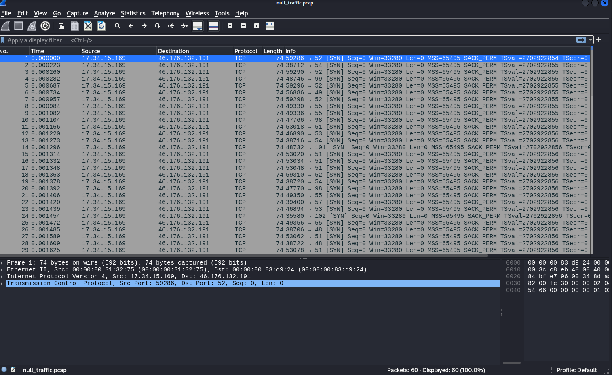

## null traffic writeup

| Δοκιμασία | Null Traffic |
| :------- | :----- |
| Δυσκολία | Εύκολη |
| Κατηγορία | Ψηφιακή Εγκληματολογία (Forensics) |
| Λύσεις | 22 |
| Πόντοι | 100 |

Η δοκιμασία αυτή μας δίνει ένα pcap αρχείο, δηλαδή ένα αρχείο το οποίο περιέχει καταγραφημένη κίνηση διαδικτύου.

Ανοίγοντας το αρχείο σε ένα πρόγραμμα ανάλυσης κίνησης διαδικτύου όπως το Wireshark, παρατηρούμε την ακόλουθη καταγραφημένη κίνηση:



Αν προσπαθήσουμε να ακολουθήσουμε οποιοδήποτε από τα TCP stream των πακέτων, καταλήγουμε σε άδειο περιεχόμενο. Ψάχνοντας παραπάνω για οποιαδήποτε άλλη χρήσιμη πληροφορία, καταλήγουμε πάντα σε αδιέξοδο.


Ρίχνοντας άλλη μια ματιά στην περιγραφή της δοκιμασίας, θυμόμαστε ότι η δοκιμασία πρόκειται για μεταφορά δεδομένων μέσω exfiltration.  

Ρίχνοντας άλλη μια ματιά σε πιθανά πεδία που μπορεί να έχουν πειραχτεί για την μεταφορά δεδομένων μέσω αυτών, βλέπουμε ότι οι αριθμοί της πόρτας της διεύθυνσης στην οποία στέλνονται τα πακέτα είναι πάντα μικροί - εντός του εύρους των printable ascii χαρακτήρων.

Από απορία δημιουργούμε το ακόλουθο πρόγραμμα σε python χρησιμοποιώντας την βιβλιοθήκη scapy ώστε να μπορέσουμε να διαβάσουμε το pcap αρχείο και να πάρουμε τους αριθμούς από τις πόρτες:
```py
from scapy.all import *

packets = rdpcap("null_traffic.pcap")

for p in packets:
    if p.haslayer(TCP):
	    dst_port = p[TCP].dport
	    print(chr(dst_port), end='') 
        # Converted to chr to get the ascii
```

Τρέχοντας το πρόγραμμα αυτό, λαμβάνουμε το ακόλουθο αποτέλεσμα:  
```sh
└─$ python solver.py 
464c41477b356e33346b795f703032375f337866316c7432343731306e7d
```

Φαίνεται αρκετά σαν να έχει χρησιμοποιηθεί κωδικοποίηση hex, οπότε και προσπαθούμε να το αποκωδικοποιήσουμε μέσω της κωδικοποίησης αυτής. Προσπαθώντας το, παίρνουμε το flag:
```py
>>> bytes.fromhex("464c41477b356e33346b795f703032375f337866316c7432343731306e7d")
b'FLAG{5n34ky_p027_3xf1lt24710n}'
```
