# nwbin Write-Up

| Δοκιμασία | nwbin |
| :------- | :----- |
| Δυσκολία | Μέτρια |
| Κατηγορία | Αντίστροφη Mηχανική (Reverse Engineering) |
| Λύσεις | 11 |
| Πόντοι | 475 |

## Περιγραφή Δοκιμασίας

```
Γρίφος; ... σε δοκιμασία αντίστροφης μηχανικής;
```

Αρχείο: [rev-nwbin.zip](https://drive.google.com/file/d/15vVd0FCIKNV7qb-S2qs0O03Wi0Qh8dDJ/view?usp=sharing)

## Επίλυση
### Με μια πρώτη ματιά

Μας δίνεται ένα εκτελέσιμο αρχείο. Μόλις το τρέξουμε, εμφανίζεται ένα παράθυρο με ένα γρίφο:
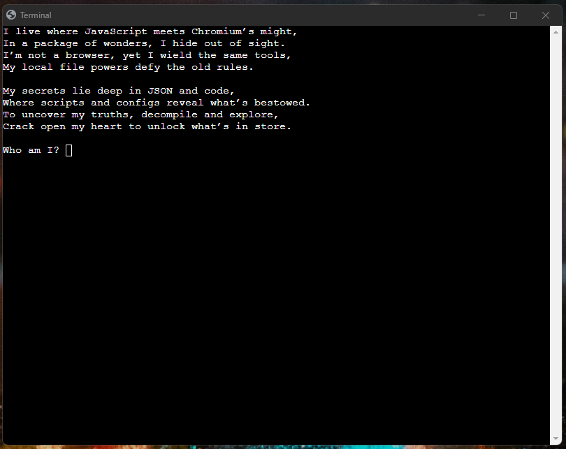

Κοιτώντας τις ιδιότητες του αρχείου βλέπουμε και στην περιγραφή του πως γράφει `nwjs`:
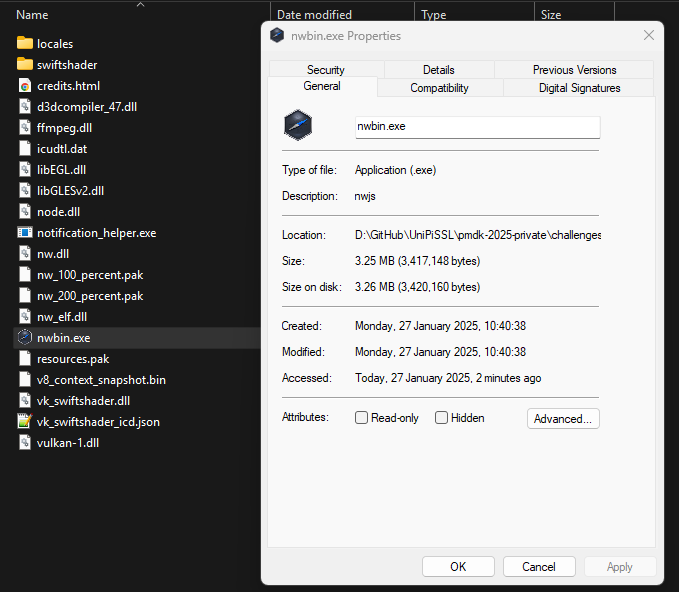

Ψάχνοντας για τον γρίφο και για το τι μπορεί να είναι το `nwjs` βρίσκουμε την ιστοσελίδα του project:
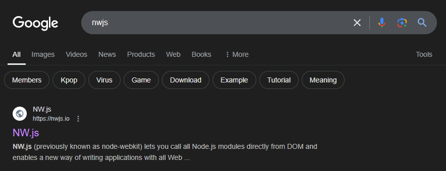
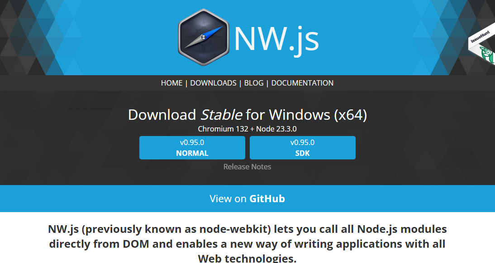

Βάζοντας το `nwjs` σαν απάντηση στον γρίφο, βλέπουμε πως είναι η σωστή απάντηση, αλλά δεν γίνεται κάτι:
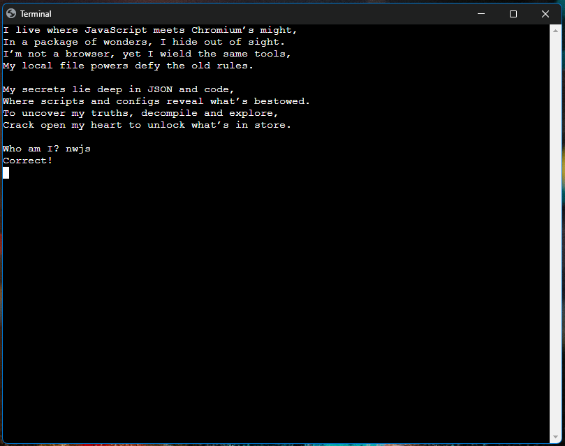

### Ανάλυση
Μιας και σε αρκετές περιπτώσεις όταν φτιάχνονται εκτελέσιμα αρχεία, για παρόμοια project (π.χ. electron) ή για installers, τα αρχεία συμπιέζονται, μπορούμε να προσπαθήσουμε να ανοίξουμε το αρχείο σαν συμπιεσμένο αρχείο:
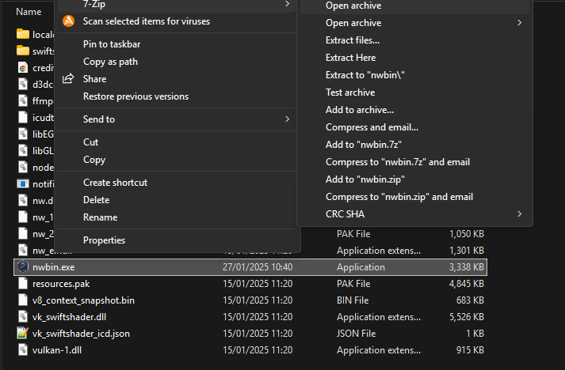
Το οποίο μας αποκαλύπτει και τα HTML, JS αρχεία της εφαρμογής:
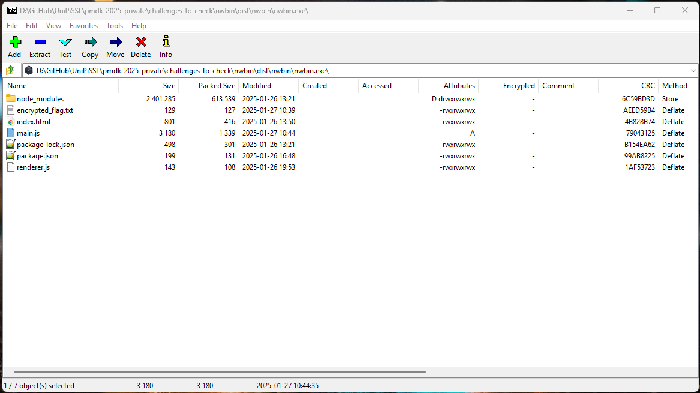

Μέσα στο `main.js` βρίσκουμε και το κομμάτι του κώδικα το οποίο σχετίζεται με την σημαία:
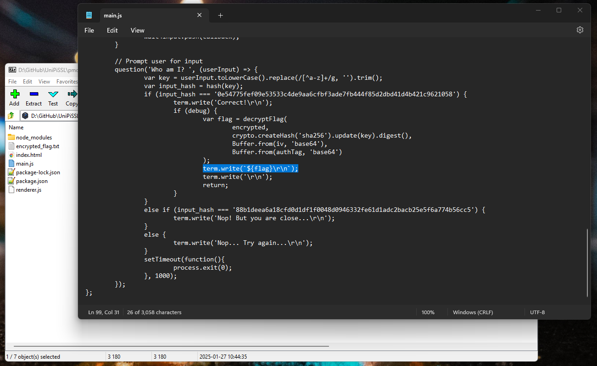

Για να μπορέσει να εκτελεστεί ο κώδικας αυτός και να πάρουμε την σημαία, πρέπει να ενεργοποιήσουμε το `debug`. Οπότε, απλά κάνουμε την αντίστοιχη αλλαγή στον κώδικα και τον αποθηκεύουμε:
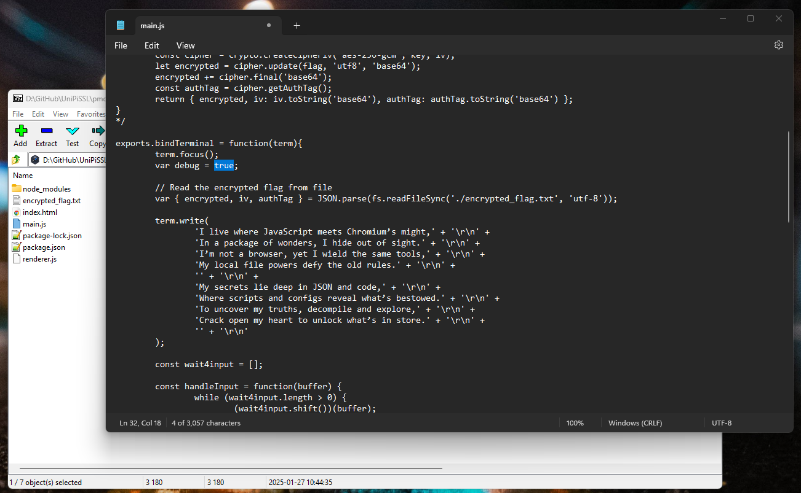
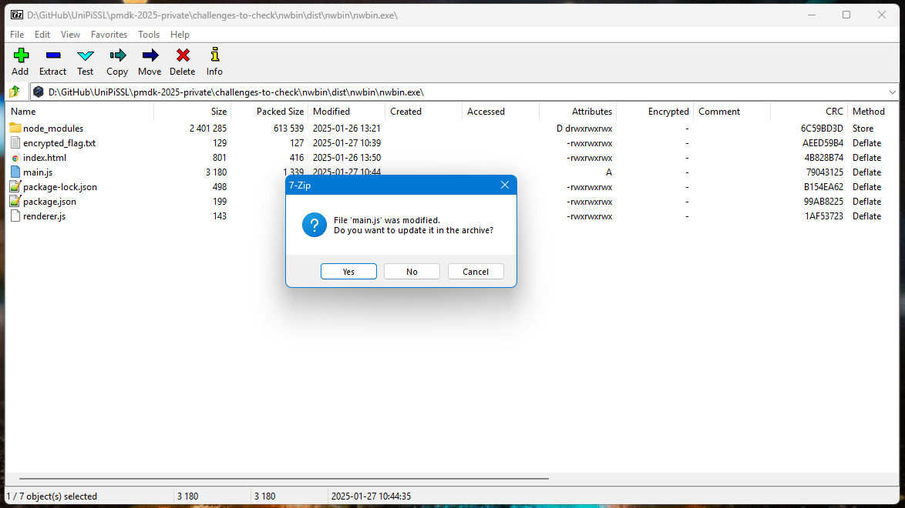

Μετά εκτελούμε ξανά το αρχείο και αφού δώσουμε την σωστή απάντηση, εμφανίζεται η σημαία:
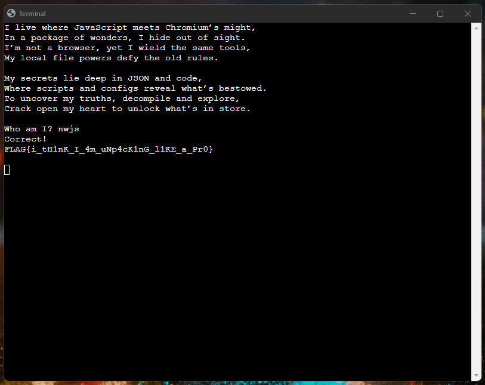
